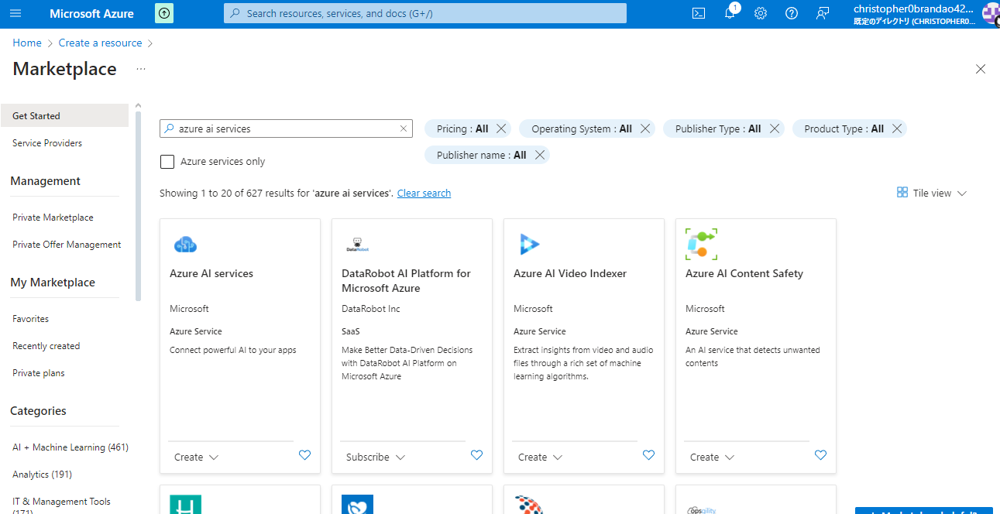
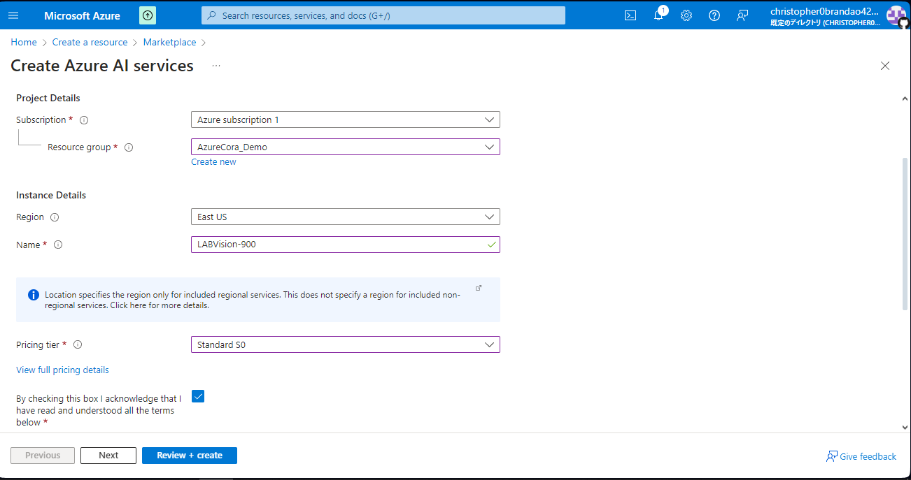
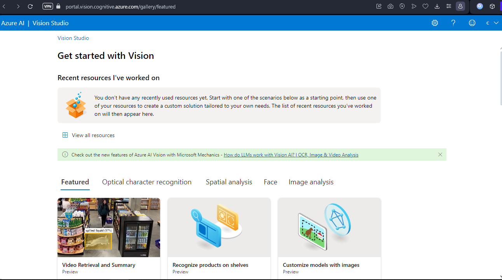
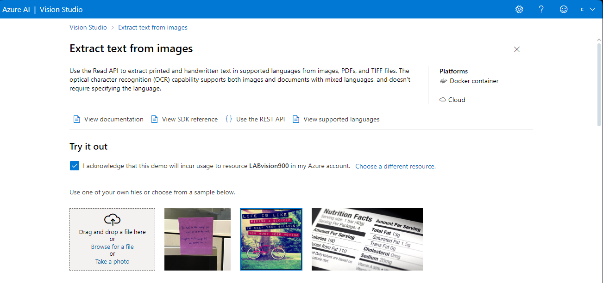
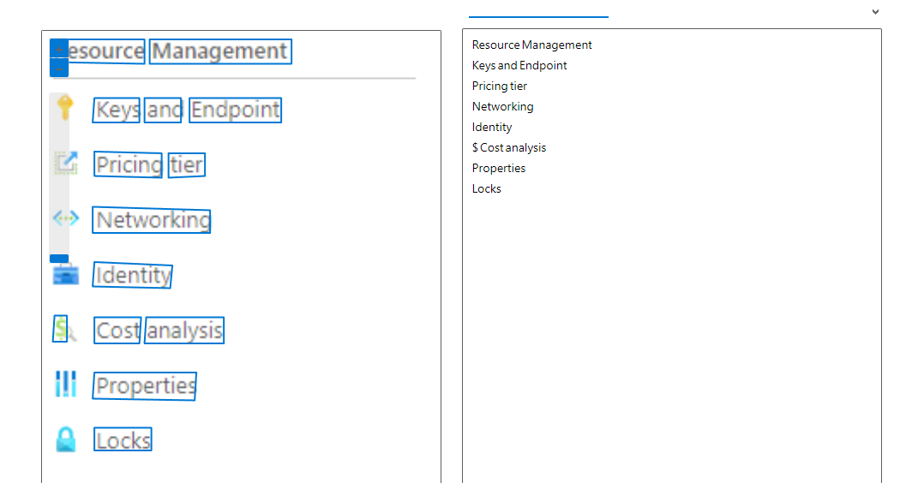

# dio_challenges_azure_vision
Project made during DIO's "Microsoft Azure AI Fundamentals" Bootcamp, under the section "Reconhecimento Facial e transformação de imagens em Dados no Azure ML"

Reference links:

- [Detect faces in Vision Studio](https://microsoftlearning.github.io/mslearn-ai-fundamentals/Instructions/Labs/04-face.html)
- [Read text in Vision Studio](https://microsoftlearning.github.io/mslearn-ai-fundamentals/Instructions/Labs/05-ocr.html)
- [Analyze images in Vision Studio](https://microsoftlearning.github.io/mslearn-ai-fundamentals/Instructions/Labs/03-image-analysis.html)

## Followed step-by-step

1. Acessing Azure Portal
2. Clicking on "Create resource"
3. Searching for "Azure AI services" on Marketplace

   
4. Clicking on "Create"
5. Selecting subscription plan, rescource group and assigning a name
6. Selecting pricing tier
7. Clicking on "Review + create"

   
8. Acessing portal.vision.cognitive.azure.com

   
9. Clicking on "View all resources"
10. Selecting resource and clicking on "Select as default resource"
11. Returning to home page
12. Clicking on "Optical character recognition" and then on "Extract text from images"

    
13. Selecting box ("I acknowledge that this demo...") and then uploading images to check detected text (example below)

**Noted points:** This resource and other Vision Studio resources can be used in various environments; more info at tht end of the page
